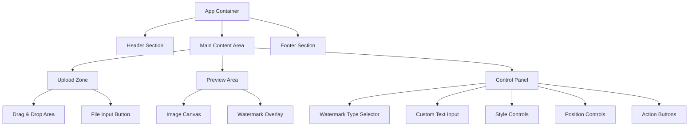

# Design Document

## Overview

圖片浮水印工具是一個現代化的單頁應用程式，採用簡潔直觀的設計理念。使用 Bootstrap 5 框架確保響應式設計和一致的視覺體驗。整體設計遵循現代 UI/UX 最佳實踐，包括卡片式佈局、漸進式揭露、即時預覽和觸控友善的互動設計。

## Architecture

### 技術架構
- **前端框架**: 純 HTML5 + CSS3 + Vanilla JavaScript
- **UI 框架**: Bootstrap 5.3.x
- **圖片處理**: HTML5 Canvas API
- **檔案處理**: File API
- **響應式設計**: Bootstrap Grid System + CSS Flexbox
- **部署**: 靜態檔案，可直接託管或嵌入

### 設計原則
1. **簡潔優先**: 最小化認知負荷，一次只顯示必要的選項
2. **漸進式揭露**: 根據使用者操作逐步顯示功能
3. **即時回饋**: 所有操作提供即時視覺預覽
4. **觸控友善**: 按鈕和控制項適合手指操作
5. **無障礙設計**: 符合 WCAG 2.1 AA 標準

## Components and Interfaces

### 主要組件結構



### 1. 上傳區域 (Upload Zone)
**設計特點:**
- 大型拖放區域，視覺上明確標示
- 使用虛線邊框和圖示，符合現代設計慣例
- 支援點擊上傳和拖放上傳
- 載入狀態使用 Bootstrap Spinner

**Bootstrap 組件:**
```html
<div class="card border-2 border-dashed">
  <div class="card-body text-center p-5">
    <i class="bi bi-cloud-upload fs-1 text-muted"></i>
    <h5>拖放圖片或點擊上傳</h5>
    <button class="btn btn-primary btn-lg">選擇圖片</button>
  </div>
</div>
```

### 2. 預覽區域 (Preview Area)
**設計特點:**
- 響應式圖片容器，自動調整大小
- 使用 Canvas 進行即時預覽
- 浮水印可拖拽定位
- 縮放控制適應不同螢幕尺寸

### 3. 控制面板 (Control Panel)
**設計特點:**
- 使用 Bootstrap Accordion 組織功能
- 卡片式設計，每個功能區塊獨立
- 使用 Range Slider 和 Button Group
- 即時預覽所有調整

**功能區塊:**
- 浮水印類型選擇 (Button Group)
- 自訂文字輸入 (Input Group)
- 樣式控制 (Range Sliders)
- 位置控制 (Button Grid)

### 4. 響應式佈局

**桌面版 (≥992px):**
```
┌─────────────────────────────────────┐
│              Header                 │
├─────────────┬───────────────────────┤
│   Upload    │                       │
│   Zone      │    Preview Area       │
│             │                       │
├─────────────┤                       │
│   Control   │                       │
│   Panel     │                       │
└─────────────┴───────────────────────┘
```

**平板版 (768px-991px):**
```
┌─────────────────────────────────────┐
│              Header                 │
├─────────────────────────────────────┤
│            Upload Zone              │
├─────────────────────────────────────┤
│           Preview Area              │
├─────────────────────────────────────┤
│           Control Panel             │
└─────────────────────────────────────┘
```

**手機版 (<768px):**
- 單欄佈局
- 較大的觸控按鈕 (min-height: 44px)
- 簡化的控制選項
- 底部固定操作按鈕

## Data Models

### 圖片資料模型
```javascript
class ImageData {
  constructor() {
    this.file = null;           // File object
    this.canvas = null;         // Canvas element
    this.context = null;        // Canvas context
    this.originalWidth = 0;     // 原始寬度
    this.originalHeight = 0;    // 原始高度
    this.displayWidth = 0;      // 顯示寬度
    this.displayHeight = 0;     // 顯示高度
  }
}
```

### 浮水印設定模型
```javascript
class WatermarkConfig {
  constructor() {
    this.type = 'text';         // 'text' | 'preset'
    this.text = '';             // 自訂文字
    this.presetType = '';       // 預設類型 ('taiwan-id')
    this.position = 'bottom-right'; // 位置
    this.opacity = 0.5;         // 透明度 (0-1)
    this.fontSize = 24;         // 文字大小
    this.color = '#000000';     // 文字顏色
    this.x = 0;                 // X 座標
    this.y = 0;                 // Y 座標
  }
}
```

### 預設浮水印類型
```javascript
const PRESET_WATERMARKS = {
  'taiwan-id': {
    text: '僅供身分驗證使用',
    fontSize: 20,
    color: '#ff0000',
    opacity: 0.6,
    position: 'center'
  }
};
```

## Error Handling

### 錯誤類型和處理策略

1. **檔案上傳錯誤**
   - 不支援的檔案格式 → Toast 通知 + 支援格式說明
   - 檔案過大 → 進度條 + 壓縮建議
   - 網路錯誤 → 重試按鈕

2. **圖片處理錯誤**
   - Canvas 渲染失敗 → 降級到基本模式
   - 記憶體不足 → 自動調整圖片尺寸

3. **瀏覽器相容性**
   - 不支援 Canvas → 顯示相容性警告
   - 不支援 File API → 提供替代上傳方式

### 錯誤 UI 設計
```html
<!-- Bootstrap Alert 組件 -->
<div class="alert alert-danger alert-dismissible" role="alert">
  <i class="bi bi-exclamation-triangle-fill"></i>
  <strong>錯誤!</strong> 請選擇有效的圖片檔案 (JPG, PNG, GIF)
  <button type="button" class="btn-close"></button>
</div>
```

## Testing Strategy

### 測試層級

1. **單元測試**
   - 圖片處理函數
   - 浮水印生成邏輯
   - 設定驗證函數

2. **整合測試**
   - 檔案上傳流程
   - 預覽更新機制
   - 下載功能

3. **使用者體驗測試**
   - 響應式設計測試
   - 觸控操作測試
   - 效能測試 (大圖片處理)

4. **相容性測試**
   - 主流瀏覽器測試
   - 行動裝置測試
   - 嵌入模式測試

### 測試工具
- **單元測試**: Jest
- **E2E 測試**: Playwright
- **視覺回歸測試**: Percy
- **效能測試**: Lighthouse

## UI/UX 設計細節

### 現代設計元素

1. **色彩系統**
   - 主色調: Bootstrap Primary (#0d6efd)
   - 輔助色: Bootstrap Secondary (#6c757d)
   - 成功色: Bootstrap Success (#198754)
   - 警告色: Bootstrap Warning (#ffc107)

2. **字體系統**
   - 主字體: Bootstrap 預設字體堆疊
   - 圖示: Bootstrap Icons
   - 字體大小: Bootstrap Typography Scale

3. **間距系統**
   - 使用 Bootstrap Spacing Utilities
   - 一致的 padding 和 margin
   - 響應式間距調整

4. **動畫效果**
   - CSS Transitions 用於狀態變化
   - 載入動畫使用 Bootstrap Spinners
   - 微互動提升使用體驗

### 嵌入模式設計

**檢測嵌入環境:**
```javascript
const isEmbedded = window.self !== window.top;
```

**嵌入模式調整:**
- 移除不必要的 header/footer
- 簡化導航元素
- 調整最小高度
- 優化通訊機制 (postMessage)

### 無障礙設計

1. **鍵盤導航**
   - 所有互動元素支援 Tab 導航
   - 明確的 focus 指示器
   - 合理的 tabindex 順序

2. **螢幕閱讀器支援**
   - 適當的 ARIA 標籤
   - 語意化 HTML 結構
   - 替代文字和描述

3. **色彩對比**
   - 符合 WCAG AA 標準
   - 不僅依賴色彩傳達資訊
   - 高對比模式支援